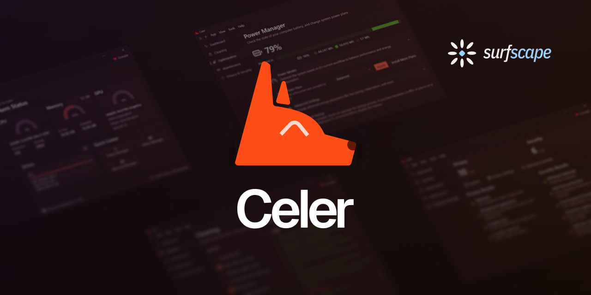

# Celer [BETA]

> The open source, advanced, friendly and cutest toolbox for Windows 10 & 11.

> [!IMPORTANT]
> Celer is still a work in progress and thus should only be used for testing. Please be patient for a stable release.

 

## Table of Contents

- [1. Introduction](#introduction)
- [2. Features](#features)
- [3. Requirements](#requirements)
- [4. Installation](#installation)
- [5. Roadmap](#roadmap)
- [7. Contributing](#contributing)
- [8. License](#license)

## Introduction

Celer is an app for Windows 10 & 11 with the purpose of giving you back control of your system. The app is structured into modules that contain various features that help you maintain your machine optimized.

## Features

- Dashboard - real time information of the hardware
- Cleaning - clean up unnecessary files from the system (+ limited support for third party software)
- Optimization - general battery & energy data, sensors, memory, GPU, and more
- Maintenance - easy access to Windows internal repair tools and network testing (with option to change DNS system-wide)
- Privacy & Security - general information of the system's privacy and security ratings

### Requirements

- Windows 10 or 11 (64-bit only)
- Minimum of 1 GB of available RAM \*
- Minimum of 150 MB of free disk space
- [.NET Runtime 10 (x64)](https://dotnet.microsoft.com/en-us/download/dotnet/thank-you/runtime-desktop-10.0.0-windows-x64-installer) must be installed

<small>\* This metric depends on the RAM available to .NET which might reduce/increase Celer memory usage</small>

## Installation

We currently only provide x64 binaries and setup files for Celer but x86 and portable packages are planned when we reach a stable release.

The setup is hosted on GitHub and can be downloaded either through [GitHub Releases](https://github.com/surfscape/celer/releases) or through [Celer's page on SurfScape](http://surfscape.eu/projects/celer/#downloads).

## Roadmap

We are currently planning new features some of these include:

- Support for third-party tools (ex: AdWare Cleaner, TRON Script, Snappy Driver Installer Origin)
- Support for third-party plugins (ex: AIDA64 and HWiNFO for system status)
- Frontend for Winget with bulk installing and updating
- ~~Light theme (already available on beta 2 but without a setting to change it)~~ Fully implemented with [commit `f70dd49`](https://github.com/surfscape/celer/commit/f70dd49088783e92f89f3728ccd6fe2eb2620edb)
- Multi-language support
- ~~Run in the background~~ Fully implemented with [commit `8811595`](https://github.com/surfscape/celer/commit/88115954d3562ae827a416edd91e21c76f483ba8)
- ~~Tray icon support with a small dashboard for quick actions (ex: cleaning temp files, restarting services and checking system status)~~ Fully implemented with [commit `8811595`](https://github.com/surfscape/celer/commit/88115954d3562ae827a416edd91e21c76f483ba8)
- Additional modules (ex: Process Manager, Disk Utilities, Windows Components Manager, and more)

## Contributing

### Commit Convention

- **feat:** commit that adds a new feature
- **fix:** commit that fixes an existing feature
- **refactor:** commit that rewrites code without adding or fixing a behaviour
  - **refactor(perf):** commit that rewrites code with the objective of improving performance
- **docs:** commit related to documentation
- **chore:** commit that doesn't fit the types above

## License

Celer is licensed under [GPL v3.0](https://www.gnu.org/licenses/gpl-3.0.en.html).
