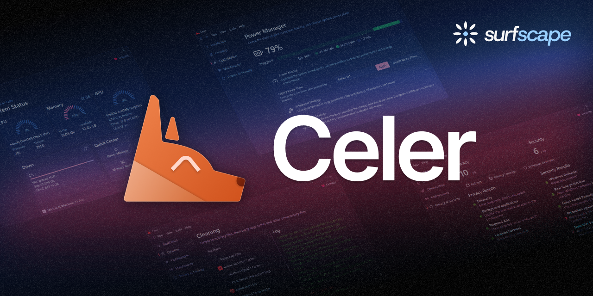

<p align="center">

</p>

# Celer

<p align="center">The open source, friendly, and cutest toolbox for Windows 10 & 11.</p>

<div align="center">

[](https://www.gnu.org/licenses/gpl-3.0.en.html)  

</div>

## Table of Contents

- [1. Introduction](#introduction)
- [2. Features](#features)
- [3. Requirements](#requirements)
- [4. Installation](#installation)
- [5. Roadmap](#roadmap)
- [6. Building](#building)
- [7. Contributing](#contributing)
- [8. License](#license)

## Introduction

Celer is an app for Windows 10 & 11 with the purpose of giving you back control of your system. The app is structured into modules that contain various features that help you maintain your machine optimized.

## Features

- Real time monitoring of system information (CPU, Memory, GPU, sensors, battery, drives).
- Cleaning of temporary files generated by the system and third party apps.
- Manage power plans (currently limited) and view battery wear.
- View memory stats (physical and virtual memory, and each slot both active and empty).
- View GPU information with support for system with 2 or more GPUs.
- Easily run the official Windows repair tools.
- Quick network status information and simple system-wide DNS changer.
- Evaluate the system's privacy and security level.

### Requirements

- Windows 10 (build 18362 or higher) or 11 x64
- *Minimum* of 300MB of available RAM \*
- Minimum of 100MB of free disk space
- [.NET Runtime 10 (x64)](https://dotnet.microsoft.com/en-us/download/dotnet/thank-you/runtime-desktop-10.0.0-windows-x64-installer) must be installed

<small>\* Due to the nature of .NET and other factors, Celer memory usage may reduce/increase with usage.</small>

## Installation

We currently only provide x64 binaries and setup files for Celer but x86 and portable packages are planned when we reach a stable release.

The setup is hosted on GitHub and can be downloaded either through [GitHub Releases](https://github.com/surfscape/celer/releases) or through [Celer's page on SurfScape](http://surfscape.eu/celer/#downloads).

## Roadmap

- Support for third-party maintenance tools (ex: AdWare Cleaner, TRON Script, Snappy Driver Installer Origin).
- Winget frontend with bulk installing and updating.
- Process and power management utilities that leverage hidden Win32 APIs.
- Multi-language support.
- Add-in system.
- Additional themes.

## Building

Celer is developed and built using Visual Studio Community 2026 and the .NET 10 SDK under a Windows 11 Pro laptop. For development and testing purposes it's important to have a fully up to date Windows 11 Pro environment, it's also recommended to have a similar environment on a Windows 10 machine (or VM) since Celer does have official Windows 10.


### Building Solution

```bash
dotnet build
```

### Running Solution

> Do note that Celer requires admin privileges and as such the following command will only work on an eleveated terminal.

```bash
dotnet run
```

## Contributing

### Commit Convention

- **feat:** commit that adds a new feature
- **fix:** commit that fixes an existing feature
- **refactor:** commit that rewrites code without adding or fixing a behaviour
  - **refactor(perf):** commit that rewrites code with the objective of improving performance
- **docs:** commit related to documentation
- **chore:** commit that doesn't fit the types above

## License

Celer is licensed under [GPL v3.0](https://www.gnu.org/licenses/gpl-3.0.en.html).

For other services Celer may use check out [SurfScape Gateway](https://github.com/surfscape/gateway).
