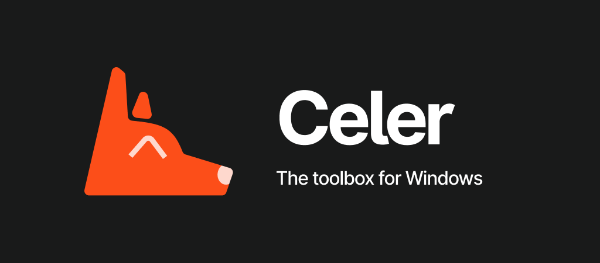

# Celer [BETA]

> The advanced, open source, friendly, and cutest toolbox for Windows 10/11!

> [!IMPORTANT]
> Celer is still a work in progress is and thus should only be used for testing. Please be patient for a stable release.

 

## Table of Contents

- [1. Introduction](#1-introduction)
- [2. Features](#3-features)
- [3. Installation](#4-installation)
- [4. Requirements](#5-requirements)
- [5. Roadmap](#6-roadmap)
- [7. Contributing](#8-contributing)
- [8. License](#9-license)

## Introduction

Celer is an app for Windows with the purpose of giving you back control of the system. The app is structured into modules that contain various features that help you maintain the computer in order without hassle.

## Features

> This section is still being worked on and thus incomplete

- Dashboard - general, in real-time, information of the system
- Cleaning - clean up unnecessary files from the system and third party apps
- Optimization - contain sub-modules related to energy & battery, memory, sensors, and more
- Maintenance - general repair tools for Windows, network testing utilities, and more
- Privacy & Security - general information of the system's privacy and security levels

## Installation

We only provide x64 setup files for Celer at this time, however x86 setup and portable packages are planned when Celer reaches a stable release.

The setup is hosted on GitHub and can be downloaded either through [GitHub Releases](https://github.com/surfscape/celer/releases) or through [Celer's page on SurfScape](http://localhost:8080/projects/celer/#downloads).

For feature compatibility and system requirements, read the section below.

## Requirements

- Windows 10 or 11 (64-bit only)
- Minimum 1 GB of available RAM \*
- Minimum 100 MB of free disk space
- [.NET Runtime 9 (x64)](https://dotnet.microsoft.com/en-us/download/dotnet/thank-you/runtime-desktop-9.0.5-windows-x64-installer) must be installed

<small>\* The actual minimum is 512MB, however this comes at a huge cost in performance and user experience</small>

## Roadmap

We are currently planning new features but also how to present them, as such for completion sake, below is a small list of features that are on the drawing board that we want to work on.

- Support for third-party tools (ex: AdWare Cleaner, TRON Script, Snappy Driver Installer Origin)
- A frontend for Winget with recommended software
- Light theme (already available on beta 2 but without a setting to change it)
- Multi-language support
- Run in the background
- Tray icon support with a small dashboard for quick actions (ex: cleaning temp files, restating services and checking system statys)

## Contributing

To be written...

## License

Celer is licensed under [GPL v3.0](https://www.gnu.org/licenses/gpl-3.0.en.html).
